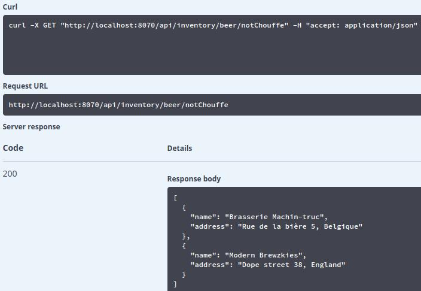

# AMT Projet 2

Author: Julien Huguet | Maximilian Vogel
Date: 2020-01-19

# Implémentation Users-api

## UML

Login API permet de manager les utilisateurs, voici l'UML de cette API.

## Chemin de l'API

### /login (POST)

Ce chemin est utilisé pour ce connecter sur l'API. Nous utilisons l'objet UserLogin qui demande un email et un password. Puis, il va retourner un JWT Token afin d'authentifier l'utilisateur.

### /users (POST)

Ce chemin permet de créer un nouvel utilisateur de type User. Seul un administrateur à le droit de créer un nouvel utilisateur.

### /users/{email} (PATCH)

Ce chemin permet à l'utilisateur de changer de mot de passe.

## Création utilisateur

Dans cette RESTAPI, nous avons implémenté la fonction createUser qui permet de créer un nouvel utilisateur avec les paramètres suivant : email, firstName, lastName, password et administrator.

Le champ administrator est utilisé afin de spécifier si l'utilisateur est un administrateur ou non. Selon le cahier des charges seul un administrateur peut créer un nouvel utilisateur, ce point est géré via le filtre isAdministratorFilter. Nous récupérons le token de la connexion et vérifions le champ administrator afin de voir si sa valeur est à 'true'. De plus, nous créons un hash du mot de passe via la dépendance BCrypt qui permet de saler et hasher un mot de passe via la fonction hashPassword. Nous retournons un statut 201 si la création s'est bien passée.

Nous avons testé la création d'un utilisateur via la commande ci-dessous:

curl -X POST "http://localhost:8080/api/users" -H  "accept: */*" -H  "Content-Type: application/json" -d "{  \"administrator\": false,  \"email\": \"john.doe@boozify.ch\",  \"firstName\": \"John\",  \"lastName\": \"Doe\",  \"password\": \"test123\"}"

Voici le résultat de la commande dans la base de donnée :

## Update Password utilisateur

Pour cette fonction, nous utilisons la fonction findByEmail présente dans le fichier UserRepository afin de retrouver l'utilisateur dans la base de donnée. Le champ email étant la clé primaire de la table users_entity. Ensuite, nous récupérons la valeur du nouveau mot de passe et nous créons un hash de ce mot de passe comme pour la création d'un utilisateur. Nous retournons un statut 201 si la mise à jour cs'est bien déroulée.

Voici la commande utilisée:

curl -X PATCH "http://localhost:8080/api/users/john.doe%40boozify.ch" -H  "accept: */*" -H  "Content-Type: application/json" -d "{  \"password\": \"works\"}"

Voici le résultat de la commande:

## Login utilisateur

Nous avons mis en place dans le controller LoginApiController la fonction loginUser qui va récupérer l'email et le mot de passe de connexion de l'utilisateur est générer le JWT token. Cette fonction retourne dans le payload le token généré et l'utilisateur sera connecté sur le site.

Voici la commande utilisée:

curl -X POST "http://localhost:8080/api/login" -H  "accept: */*" -H  "Content-Type: application/json" -d "{  \"email\": \"bla@bla.ch\",  \"password\": \"test\"}"

Voici le résultat:

## Génération JWT Token

Pour la génération du JWT Token, nous utilisons la librairie jsonwebtoken. Cette librairie nous permet de créer une signature et de générer le token via plusieurs paramètres. Nous passons les paramètres suivants dans le token : la date de création du token, l'expiration du token (nous sommes partis sur une durée de 24heures pour les tests), le rôle de l'utilisateur et la signature.

De plus, nous avons mis en place une fonction de decodage du JWT Token.

# Implémentation de l'API Beers

Cette API permet au client de récupérer des informations pour des bières et bars ainsi que de modifier ces informations tout en pouvant chercher quelles bières sont servies dans un bar donné et quels bars servent une bière donnée.

Pour cela cette API comporte 3 controllers, un pour chaque table de la base de données.

## UML

## Beers Controller

Ce controller permet de gérer individuellement les bières. On peut récupérer la liste de bières existantes, récupérer les informations d'une bière spécifique via son nom ainsi que créer, supprimer et mettre à jour une bière.

### /beers (GET)

Retourne une liste de toutes les bières existantes.

### /beers (POST)

Ajoute une bière à partir d'un objet json.

### /beers/{name} (GET)

Récupère les informations concernant une bière spécifique à partir du nom.

### /beers/{name} (DELETE)

Supprime une bière à partir de son nom.

### /beers/{name} (PATCH)

Met à jour les informations d'une bière en indiquant le nom de la bière à changer, ainsi qu'un objet json représentant la bière mise à jour.

## Bars Controller

Ce controller permet de gérer individuellement les bars. On peut récupérer la liste de bars existants, récupérer les informations d'un bar spécifique via son nom ainsi que créer, supprimer et mettre à jour un bar.

### /bars (GET)

Retourne une liste de tous les bars existants.

### /bars (POST)

Ajoute un bar à partir d'un objet json.

### /bars/{name} (GET)

Récupère les informations concernant un bar spécifique à partir du nom.

### /bars/{name} (DELETE)

Supprime un bar à partir de son nom.

### /bars/{name} (PATCH)

Met à jour les informations d'un bar en indiquant le nom du bar à changer, ainsi qu'un objet json représentant le bar mis à jour.

## Inventory Controller

Ce controller fait le lien entre les bières et les bars en permettant de récupérer la liste de bières servies par un bar, les bars servant une bière donnée ou en permettant d'ajouter une bière à l'inventaire d'un bar.

### /inventory/bar/{name}

Permet de renvoyer une liste de toutes les bières dans l'inventaire d'un bar donné. Il faut indiquer le nom du bar.

### /inventory/beer/{name}

Permet de renvoyer une liste de tous les barres ayant la bière (d'après son nom) indiquée dans leur inventaire.

### /inventory/bar/{name}/{beer}

Cette fonction est censée ajouter une bière à l'inventaire d'un bar, cependant, son implémentation est incorrecte pour l'instant.